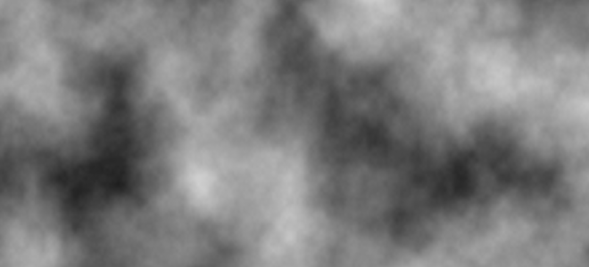

# JNoise


[](../LICENSE)
[](https://github.com/RichardLitt/standard-readme)

JNoise is a simple-to-use java-library for generating noise (including gradient noise) in Java.

JNoise was created in early 2020 by Lukas Mansour (Articdive). It was created for a project in Minecraft for custom terrain generation. It works for all Java 8+ apps and is built using [Gradle](https://gradle.org/).

## Table of Contents
- [Install](#install)
- [Usage](#usage)
- [Maintainers](#maintainers)
- [Acknowledgements](#acknowledgements)
- [Contributing](#contributing)
- [License](#license)

## Install
### Maven and Gradle
To add JNoise to your project using [Gradle](https://gradle.org/) or [Maven](http://maven.apache.org/):

Repository (Maven):
```
<repository>
    <id>articdive-nexus</id>
    <url>https://repo.articdive.de/repository/maven-public/</url>
</repository>
```
Dependency (Maven):
```
<dependency>
    <groupId>de.articdive</groupId>
    <artifactId>jnoise</artifactId>
    <version>VERSION</version>
</dependency>
```

Repository (Gradle Kotlin DSL)
```
repositories {
    maven {
        name = "Articdive's nexus repository"
        url = uri("https://repo.articdive.de/repository/maven-public/")
    }
}
```
Dependency (Gradle Kotlin DSL)
```
dependencies {
    // JNoise Library
    implementation("de.articdive:jnoise:VERSION")
}
```
## Usage

### Picking your Noise-Type.
The JNoise library supports Perlin-, OpenSimplex-, Value- and white-noise.

It also supports octavated (fractals) versions of Perlin-, OpenSimplex-, Value- and white-noise.

Every noise-type has different features, e.g. Perlin Noise supports different types of Interpolation, whereas OpenSimplex does not support Interpolation.

These are all documented in the respective builders/generators of the noise-type.

Normally if you are using an IDE, the code-completition is intuitive enough to use this library without having to check for features.

Example: Creating a noise-generator using Perlin Noise with cosine Interpolation.
```java
        JNoise perlinCosine = JNoise.newBuilder().perlin().setInterpolation(InterpolationType.COSINE).setSeed(1729).build();
```

### Getting Normal Noise Values
The Noise's dimension has to do with the amount of parameters. If you add one double after the getNoise method, you will receive 1 dimensional noise.

All Noise Implementations support 2D,3D and 4D noise.

OpenSimplex Noise is the only noise-type to not support 1D noise.

Example: Getting 1D Perlin-Noise:
```java
    public JNoise perlinLinear = JNoise.newBuilder().perlin().setInterpolation(InterpolationType.LINEAR).setSeed(1629).build();
    public double getNoise(double x) {
        // 1D Noise
        return perlinLinear.getNoise(x)
    }
```
Example: Getting 2D Perlin-Noise:
```java
    public JNoise perlinLinear = JNoise.newBuilder().perlin().setInterpolation(InterpolationType.LINEAR).setSeed(1629).build();
    public double getNoise(double x, double y) {
        // 2D Noise
        return perlinLinear.getNoise(x, y)
    }
```

### Getting Fractals (Octavated) Noise Values
In this case way to get noise values is the exact same (using getNoise()), except in the creation of your builder you use the octavated noise type
and supply a noise-type to octavate.

Example: Creating a noise-generator using Octavated Perlin Noise with Cosine Interpolation.
```java
        public JNoise octavatedPerlin = JNoise.newBuilder().octavated().setNoise(
            JNoise.newBuilder().perlin().setInterpolation(InterpolationType.COSINE).setSeed(1629).build()
        ).setOctaves(4).setPersistence(0.5).setLacunarity(0.5).build();
```

## Maintainers
[@Articdive](https://www.github.com/Articdive/)

## Acknowledgements
[@Ken Perlin](https://mrl.nyu.edu/~perlin/)'s work on Perlin Noise and Simplex Noise.

[@Kurt Spencer](https://www.github.com/KDotJpg)'s work on OpenSimplex Noise located [here](https://gist.github.com/KdotJPG/b1270127455a94ac5d19).

## Contributing
See [the contributing file](CONTRIBUTING.md)!

## License
[GNU General Public License v3.0 or later © Lukas Mansour (Articdive) ](../LICENSE)